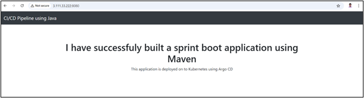

# TRADITIONAL APPROACH:

The Below Stpes are used to make live an simple Java Spring application in Ubuntu22 Machine.

1. First Create an Ubuntu22 EC2 instance in AWS or Whatever platfrom you prefer.
2. My application Code all will be placed in the spring-boot-app folder, Copy the entire Project folder into the AWS server.
3. If we are going to make live an Java application the below pre-requisites are much needed.

```
sudo apt update

sudo apt install openjdk-17-jdk -y

java -version

sudo apt install maven -y
```

4. Then Create the Java Project as a Jar file run the below Maven command:

```
mvn clean package (For Creating Jar file)
```
5. Once you run the mvn clean package command, You will get the jar file in the same directory and path would be target/spring-boot-web.jar

6. Run your Spring Boot application using the below Command:

java -jar target/spring-boot-web.jar (Just running the Application)

nohup java -jar target/spring-boot-web.jar & (Running the Application in Backend)

Note: Open the Port 8080 and Check the application Status.




