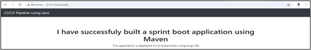

# HOW TO CONVERT THE APPLICATION AS DOCKER CONTAINER:

1. First Create an Ubuntu22 EC2 instance in AWS or Whatever platfrom you prefer.
2. My application Code all will be placed in the spring-boot-app folder, Copy the entire Project folder into the AWS server.
3. If we are going to make live an Java application the below pre-requisites are much needed.

```
sudo apt update

sudo apt install openjdk-17-jdk -y

java -version

sudo apt install maven -y
```

4. Then Create the Java Project as a Jar file run the below Maven command:

```
mvn clean package (For Creating Jar file)
```
Create the Dockerfile to Build the the application as container. Your Docker file would be in the exact project folder where pox.xml is there.

My Docker build file will be in the Following Path: 2.CONTAINER_AN_APPLICATION/spring-boot-app/DockerFile

5. Build the application as an Image:

```
docker build -t my-spring-app:1.0 .

docker images
```

6. Run the Container and Expose the Port to Outside:

```
docker run -d -p 8080:8080 my-spring-app:1.0
```

# Check The Application Status:


