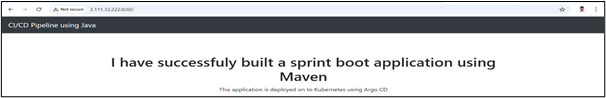

# USED JENKINS AND CREATED JAR FILE USING MAVEN

1. Install Jenkins in a Linux Machine using the below Commands:

```
sudo apt update

sudo apt install openjdk-17-jre

java -version

curl -fsSL https://pkg.jenkins.io/debian/jenkins.io-2023.key | sudo tee \
  /usr/share/keyrings/jenkins-keyring.asc > /dev/null

echo deb [signed-by=/usr/share/keyrings/jenkins-keyring.asc] \
  https://pkg.jenkins.io/debian binary/ | sudo tee \
  /etc/apt/sources.list.d/jenkins.list > /dev/null

sudo apt-get update
sudo apt-get install jenkins

```

2. Create The Pipeline project in Jenkins and Choose the Github as a SCM.

Maven Plugin needed for this, After install the Maven just Set it in the Global Configuration tools and call it in our groovy Script.

My pipeline Groovy Script Placed in the following Path: 3.CICDPROJECT_USING_MAVEN/spring-boot-app/JenkinsFile (Should be placed in the pox.xml folder)

3. Start the BUild. Once Build completed JAR File would be located in the Jenkins WorkSpace Folder and Path would be /var/lib/jenkins/workspace/<buildname>/spring-boot-app/target/

4. Check the Apllication Status in the Same Jenkins Server.

Note: Both Jenkins and Spring Boot listens the Same Port 8080, So we need to stop the Jenkins. (systemctl stop jenkins)

Then Run the JAR File: nohup java -jar target/spring-boot-web.jar &

5. Check On the Browser, You will get the Page.




